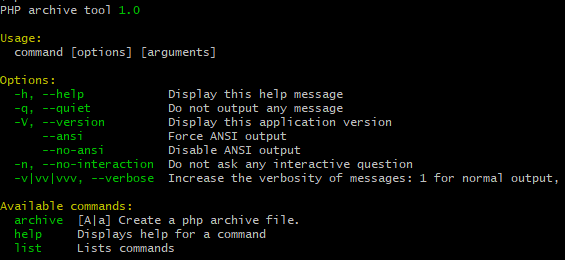

## PHP settings
 Open your php.ini file and change `#phar.readonly` to `phar.readonly = Off`     
 You can run `php --ini` to locate your php.ini file.   
 You need administrator permission to run this project correctly.   
## Build 
```
git clone https://github.com/vsfdqfpdpg/phar.git
cd phar
composer install
sudo php index.php archive
sudo phar
``` 
If everything run successfully, You will see output below.


## Start
`cd` your project folder and run `phar archive` command in your project folder.   
If your project does not have `phar.json` file it will create one for you and you need change this file accordingly.      
This phar application need two settings which stored in `phar.json` file. `name` field is the command you are running on terminal. `stub` field is your application's entry point.

`phar.json`
```json
{
  "name": "phar",
  "stub": "index.php"
}
```

When you finished editing `phar.json` file and run `phar archive` again. It will create executable file and you can execute this "name" filed command through terminal. In this example it called `phar`. 